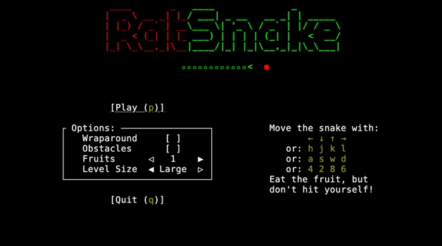
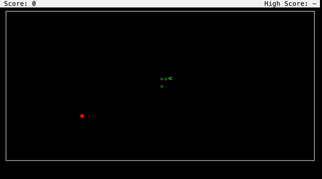

[](https://www.repostatus.org/#active)
[](https://github.com/jwodder/ratsnake/actions/workflows/test.yml)
[](https://codecov.io/gh/jwodder/ratsnake)
[](https://www.rust-lang.org)
[](https://opensource.org/licenses/MIT)

[GitHub](https://github.com/jwodder/ratsnake) | [crates.io](https://crates.io/crates/ratsnake) | [Issues](https://github.com/jwodder/ratsnake/issues) | [Changelog](https://github.com/jwodder/ratsnake/blob/main/CHANGELOG.md)

`ratsnake` is an implementation of the video game [Snake][] in [Rust][] built
using the [Ratatui][] library.  Guide the snake around the level to eat fruits,
making it grow longer, but don't run into yourself!

[Snake]: https://en.wikipedia.org/wiki/Snake_(video_game_genre)
[Rust]: https://www.rust-lang.org
[Ratatui]: https://ratatui.rs

[](https://asciinema.org/a/724406)

Installation
============

In order to install `ratsnake`, you first need to have [Rust and Cargo
installed](https://www.rust-lang.org/tools/install).  You can then build the
latest release of `ratsnake` and install it in `~/.cargo/bin` by running:

    cargo install ratsnake

Usage
=====

    ratsnake [<options>]

Run `ratsnake` to bring up the program's main menu.

`ratsnake` is optimized for display on 80 column by 24 line terminals.  If your
terminal is bigger than this, the interface will be centered in the middle.  If
your terminal is smaller, you're going to have a bad time.

All screens in `ratsnake` support directional movement with the arrow keys,
<kbd>h</kbd>/<kbd>j</kbd>/<kbd>k</kbd>/<kbd>l</kbd>,
<kbd>w</kbd>/<kbd>a</kbd>/<kbd>s</kbd>/<kbd>d</kbd>, and
<kbd>2</kbd>/<kbd>4</kbd>/<kbd>6</kbd>/<kbd>8</kbd>.  In addition, pressing
<kbd>Ctrl</kbd>+<kbd>C</kbd> at any point during program execution will
immediately end the program.

Options
-------

- `-c <file>`, `--config <file>` — Read program confguration from `<file>`.
  See "Configuration" below for more information.

- `-h`, `--help` — Show command-line usage

- `-V`, `--version` — Show current program version

Main Menu
---------



The main menu allows the user to configure various options for Snake before
starting a game.  The options are saved to a file (See "Configuration" below)
that is loaded on program startup and updated before starting a new game.

The following options can be set:

- **Wraparound** — If this option is set, the borders of the game level will
  wrap around so that the snake can pass into one side and come out the
  opposite.  When this is not set, the snake will die upon coming into contact
  with a level border.

- **Obstacles** — If this option is set, random obstacles will be placed in the
  game level; coming into contact with one kills the snake.

- **Fruits** — Set the number of fruits present at all times.  May be any
  integer from 1 through 10.

- **Level Size** — Set the dimensions of the game level, choosing from small
  (38×8), medium (53×12), and large (76×19).

### Key Bindings

| Key                                                        | Command                                                |
| ---------------------------------------------------------- | ------------------------------------------------------ |
| <kbd>k</kbd>, <kbd>w</kbd>, <kbd>8</kbd>, <kbd>Up</kbd>    | Move up an item                                        |
| <kbd>j</kbd>, <kbd>s</kbd>, <kbd>2</kbd>, <kbd>Down</kbd>  | Move down an item                                      |
| <kbd>h</kbd>, <kbd>a</kbd>, <kbd>4</kbd>, <kbd>Left</kbd>  | Decrease or unset the current option                   |
| <kbd>l</kbd>, <kbd>d</kbd>, <kbd>6</kbd>, <kbd>Right</kbd> | Increase or set the current option                     |
| <kbd>Tab</kbd>                                             | Move down an item, circling around at the bottom       |
| <kbd>Shift</kbd>+<kbd>Tab</kbd>                            | Move up an item, circling around at the top            |
| <kbd>Home</kbd>                                            | Jump to the first item in the menu                     |
| <kbd>End</kbd>                                             | Jump to the last item in the menu                      |
| <kbd>Space</kbd>                                           | Toggle the current option                              |
| <kbd>Enter</kbd>                                           | Toggle the current option or select the current button |
| <kbd>p</kbd>                                               | Play a game of Snake                                   |
| <kbd>q</kbd>                                               | Quit                                                   |

Game
----



Upon selecting "Play" in the main menu, a game of Snake starts immediately with
the configured options.  The snake advances one cell at a time at regular
intervals; the directional keys can be used to change its direction of motion.
The goal is to guide the snake to consume fruits (red dots) that randomly
appear on the level; eating a fruit increases your score by 1 (displayed at the
top of the screen) but also makes the snake longer, making it harder to avoid
self-collisions.

Pressing <kbd>Escape</kbd> or defocusing the terminal during play will pause
the game.  While paused, a pop-up menu is displayed, giving you the choice of
resuming/unpausing, restarting the game using the same options (though
obstacles will be re-randomized), returning to the main menu, or quitting the
program.

The game lasts until the snake's head collides with its body, the level border
(if the wraparound option was not enabled), or an obstacle, all of which kill
the snake.  (If you're very skilled, you may also get a game over if you manage
to fill the level with the snake.)  When the game ends, a message is displayed,
and you can choose to start a new game with the same options (by pressing
<kbd>r</kbd>), return to the main menu (by pressing <kbd>m</kbd>), or quit the
program (by pressing <kbd>q</kbd>).

High scores are tracked and saved to a file automatically (See "Configuration"
below).  Each combination of game options has its own separate high score.
Note that quitting a game in the middle of play will not cause a new high score
to be registered.


Configuration File
==================

`ratsnake` can be configured via a [TOML](https://toml.io) file whose
default location depends on your OS:

- Linux — `~/.config/ratsnake/config.toml` or `$XDG_CONFIG_HOME/ratsnake/config.toml`
- macOS — `~/Library/Application Support/ratsnake/config.toml`
- Windows — `%USERPROFILE%\AppData\Local\ratsnake\config.toml`

This file may contain the following tables & keys, all of which are optional
unless indicated otherwise:

- `[files]` — Configure data files
    - `high-scores-dir` (string) — Path to a directory (which `ratsnake` will
      create if it doesn't already exist) in which high scores will be stored.
      An initial `~/` will be replaced by the path to the user's home
      directory.  The default path is `$DATA_DIR/highscores/`, where
      `$DATA_DIR` is defined below.
    - `ignore-errors` (boolean) — whether to suppress notifications about any
      errors that occur while reading or writing the options file or high score
      file
    - `options-file` (string or boolean) — File path at which `ratsnake` will
      save & restore gameplay options.  An initial `~/` will be replaced by the
      path to the user's home directory.  Setting this to `false` disables
      saving & loading of options.  Setting this to `true` causes the default
      path to be used, the same as if the option were omitted.  The default
      path is `$DATA_DIR/options.json`, where `$DATA_DIR` is defined below.

- `[glyphs]` — Set the symbols & colors used to draw various elements of the
  game display.  Each of the below keys takes as its value a subtable
  containing a required `symbol` key (a single-column string) and an optional
  `style` key (a string as parsed by [`parse-style`][]).  Note that a `symbol`
  without a `style` will be drawn without any styling.
    - `collision` — Set the symbol & style used when the snake collides with
      itself, an obstacle, or the level border
    - `fruit` — Set the symbol & style used for fruit
    - `obstacle` — Set the symbol & style used for obstacles
    - `snake-body` — Set the symbol & style used for the parts of the snake's body
    - `snake-head` — Set the symbol & style used for the snake's head.
        - Unlike the other glyphs, `snake-head.symbol` may alternatively be set
          to a table with `north`, `south`, `east`, and `west` symbol keys (all
          required), giving the symbols to use for the snake's head when it's
          moving in the respective directions

- `[options]` — Set default gameplay options, for use when the options file is
  absent, disabled, or can't be read
    - `fruits` (integer from 1 to 10) — how many fruits should be present in a
      level
    - `obstacles` (boolean) — whether to generate random obstacles in levels
    - `size` — set the level size; valid options are `"small"`, `"medium"`, and
      `"large"` (case sensitive)
    - `wraparound` (boolean) — whether levels should wrap around at the borders

The default program configuration is as follows:

```toml
[files]
ignore-errors = false

# Linux, with XDG_DATA_HOME not set:
high-scores-dir = "~/.local/share/ratsnake/highscores"
options-file = "~/.local/share/ratsnake/options.json"

# macOS:
#high-scores-dir = "~/Library/Application Support/ratsnake/highscores"
#options-file = "~/Library/Application Support/ratsnake/options.json"

# Windows:
#high-scores-dir = '~\AppData\Local\ratsnake\highscores'
#options-file = '~\AppData\Local\ratsnake\options.json'

[glyphs.snake-head]
symbol = { "north" = "v", south = "^", east = "<", west = ">" }
style = "bold green"

[glyphs.snake-body]
symbol = "\u26AC"
style = "bold green"

[glyphs.fruit]
symbol = "\u25CF"
style = "bright_red"

[glyphs.obstacle]
symbol = "\u2588"
style = "white"

[glyphs.collision]
symbol = "\u00D7"
style = "reversed bright_red"

[options]
wraparound = false
obstacles = false
fruits = 1
size = "large"
```

[`parse-style`]: https://github.com/jwodder/parse-style

Data Directory
--------------

By default, options and high scores are saved in a data directory in your home
folder, referred to above as `$DATA_DIR`.  The location of this directory
depends on your OS:

- Linux — `~/.local/share/ratsnake/` or `$XDG_DATA_HOME/ratsnake/`
- macOS — `~/Library/Application Support/ratsnake/`
- Windows — `%USERPROFILE%\AppData\Local\ratsnake\`

Acknowledgements
================

Much of `ratsnake`'s functionality was inspired by
[`nsnake`](https://github.com/alexdantas/nSnake) by Alexandre Dantas (no longer
maintained).
